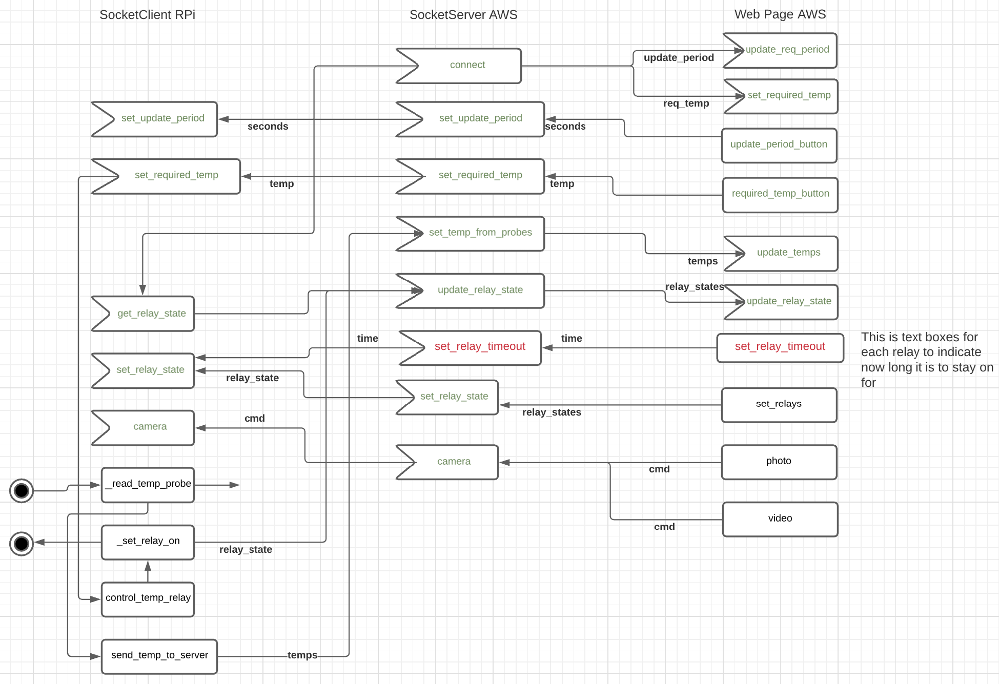

# BeerPiAWS
### Beer Temperature monitor and heater control
###### AWS version of BeerPi
* Python script reads temperature data from a temperature probe attached to a Raspberry Pi
* Json string, {"timestamp":...., "temperature": 21.5} written to Mongo DB on AWS every 10 minutes
* D3 web page reads the data and displays the trend in a graph with data points every 10 minutes
* JQuery web page shows the current temperature, can be set to auto update every n seconds.

## Installing Python 3.8 and SSL
Follow the guidance here:

https://help.dreamhost.com/hc/en-us/articles/115000702772-Installing-a-custom-version-of-Python-3

(and https://help.dreamhost.com/hc/en-us/articles/360001435926-Installing-OpenSSL-locally-under-your-username)


# Web Sockets
You can poll end-points for updates that are  made from 
web page input, but this is very chatty and the RPi is polling the AWS server every second 

A better way is to use Web Sockets, or more specifically, socket.io. Socket.io implements WebSockets
if it can, otherwise it defaults to a polling type algorithm. Anyway what this means is that the 
data is sent to the RPi, using the connection established by the RPi, only when it is needed. This will 
cut down on the data that is exchanged with the AWS server.

### Server (AWS)
Flask_socketio

https://flask-socketio.readthedocs.io/en/latest/

### Client (RPi)
python-socketio

https://python-socketio.readthedocs.io/en/latest/client.html

Supports Client side socket.io to connect to the Server.

### UI
This is a standard HTML page stored in htdocs on AWS

It uses socket.io in javascript to comunicate with the SocketIO server.

The graph is done using D3.

### Connection
* The RPi makes a connection to the http address of the socket.io Server
* The Server then returns data to the socket.io receiver running on the RPi

It's as simple as that.

An example of websocket comms is:

* The webpage is refreshed and code in `$(document).ready(function () {` is called. 
* This calls socketio.emit("get_temp_from_pi")
* The listener, @socketio.on("get_temp_from_pi"), on the server running on AWS, runs its function.
* This function calls socketio.emit("get_temp")
* On the Rpi this is picked up by sio.on("get_temp")
* This calls its function to get the temp from the probes then "emit" back to the server 
then to the UI.



### Installation Instructions
Following local dev, git add/commit/push to https://github.com/andye456/BeerPiAWS.git (this repo)

Then, using MobaXTerm, or Putty or whatever, connect to AWS Bitnami. If using Moba then goto the 
Advanced SSH Settings and use the ssh key (LightsailDefaultPrivateKey-eu-west-2.ppk) which can be downloaded from 
the AWS website.

To log on to the RPi this is a local connection and is 192.168. whatever.

cd to the BeerPiAWS directory and run `git stash`, `git pull` on both.

run `chmod a+x setup.sh; setup.sh` on both

ON the Pi cd to Sender and run `python Client.py` (Actually reset the Pi and this will start automatically))

On AWS cd to Receiver and run `nohup python Server.py &`

Browse to <my AWS ip>/beer.html

On the Pi include the following in .bashrc so that it won't start if no local network is available.

```shell script
echo "+-+-+-+-+-+-+-+-+-+-+-+-+-+-+-+-+-+-+-+-+-+-+-+-"
echo "About to start the Beer Pi sender script....."
echo "Ctrl+c in 5 seconds to abort"
echo "+-+-+-+-+-+-+-+-+-+-+-+-+-+-+-+-+-+-+-+-+-+-+-+-"
sleep 5

# Sets the relays off
python set_gpio.py

cd ~/BeerPiAWS
. venv/bin/activate
cd Sender
# Waits until the network is up before starting the application.
while true; do
        ping -c 1 -w 2 192.168.1.1
        if [[ $? -eq 0 ]]; then
                python SocketClient.py
                break
        fi
        echo "Retrying network...."
        sleep 1
done
```
